<!--
Figures + branding are referenced by relative path (assets/, assets/branding/);
keep them alongside this deck. The course-wide pedagogical-thesis intro lives in
Unit 0 (unit-0-course-intro/). This deck is Unit-1 theory only (45 min).
-->

<!-- _class: lead -->

# Unit 1 — The Graph Substrate

## Topology, modeling choices & the centrality family

### Looking only at the road map — which streets are the *arteries*?

<!--
Open on the brand title. Frame the whole unit as a sequence of DECISIONS the
analyst (and their AI) make: what is a node, what is an edge, when to simplify,
how to project, which metric answers the question. The intro/onboarding is
Unit 0 — assume it's done. Tell the room the unit ends with a hands-on
light-rail stress test, so the theory is in service of a real decision.
-->

---

<!-- _class: section -->

# Beat 1 — The artery question
## *Why arterial streets matter, and why topology carries signal* · ~5–7 min

---

# Why arterial streets matter

The word is borrowed from anatomy: **arteries carry the most blood through the
body; arterial roads carry the most traffic through a city.** A handful of these
streets carry the whole place — and when planners argue over them, money and
safety are on the line:

- **Congestion** — where traffic piles up day after day.
- **Emergency access & resilience** — can crews still reach every block if one
  corridor is cut?
- **Where to add transit** — which corridor would a new bus or light-rail line
  actually serve?

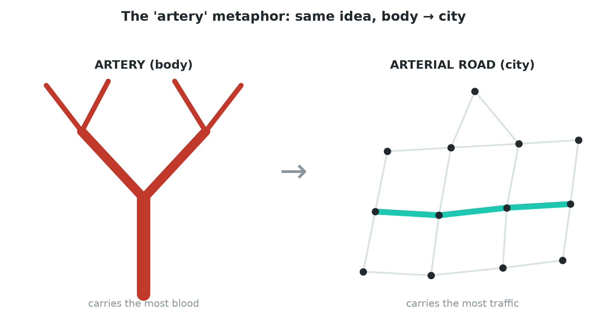

<!--
Lead with stakes BEFORE the abstract framing, and ground the *word* first: the
term "arterial" is an anatomy metaphor — arteries are the big vessels carrying
the most blood; arterial roads are the big streets carrying the most traffic.
The figure makes that metaphor literal: a branching blood vessel on the left,
the same branching idea as a road network on the right, "carries the most blood
→ carries the most traffic." Then the three real decisions arterial analysis
feeds: congestion management, emergency access/resilience (close one corridor —
is the city still reachable?), and transit planning (the unit's own practice
task is exactly the light-rail version of "where to add transit"). Ask the room:
in YOUR city, which streets would these questions land on?
-->

---

# The motivating question

All that traffic piles onto *some* streets. **Which ones?**

> Looking at **just a road map** — no traffic counts, no tags, no coordinates —
> can you tell which streets are the **arteries**? And can you define "artery"
> **rigorously enough that a computer can find them**?

This is a **methodology** question: how do we make "structural importance"
*computable*? (Not a road-type classification task.)

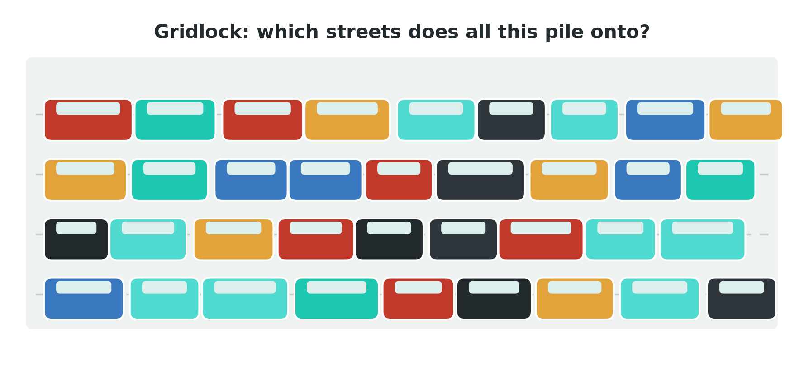

<!--
Now the abstract framing, earned by the previous slide's stakes. The traffic-jam
figure is a light, slightly funny gridlock — it lightens the mood and motivates
the question viscerally: all those cars pile onto SOME streets, so which? Keep
the slide on DEFINING importance, not the syllabus's residential-vs-arterial
classification (that's the wrong-class extension students can pick in practice).
The whole unit is the answer to "define artery rigorously." Pause here: ask
students to attempt a one-sentence definition before we make it formal.
-->

---

# What "topology" means here

**Topology** = the pure **connection pattern** — which street meets which —
**independent of geometry, length, tags, or flow.**

Same connection pattern → same topology, even if you stretch the map or rename
every street.

> The surprising claim of this unit: that pattern **alone** already separates
> structurally important streets from incidental ones [(Crucitti et al., 2006)](https://arxiv.org/abs/physics/0504163), [(Porta et al., 2006)](https://arxiv.org/abs/physics/0506009).

<!--
Define the load-bearing word before we lean on it — and let the definition stand
ALONE on the slide (the illustration has been moved to the roadmap slide so this
one isn't cramped). Topology = adjacency only: who connects to whom. Stripping
geometry/tags/flow is not a limitation, it's the experiment — we ask how much
signal survives in connection-pattern ALONE. The "topology vs flow" figure that
used to live here now appears beside the roadmap on the next slide; we return to
the topology≠flow gap properly in Beat 5.
-->

---

# The measurements we'll build (roadmap)

| We'll measure… | …which answers |
|---|---|
| **Degree** | how many streets meet here? |
| **Closeness** | how near to everywhere? |
| **Betweenness** | how many routes pass through? |
| **Meshedness** | how grid-like is the fabric? |
| **Components / clustering** | whole? triangles? |

Each is computed from **topology alone** — that connection pattern, no flow.
Defined properly in Beats 3–4.

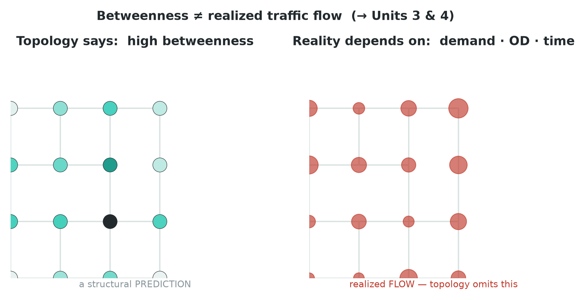

<!--
This is the referent the later centrality beat points back to (review change 3).
Give students the MAP of where we're going before the detail: a family of
topology-only measurements, each answering a different plain-language question.
The figure (moved here from the topology-definition slide) previews that
structure (left) is a different object from realized flow (right) — every
measurement in this table reads the LEFT object; we return to the gap in Beat 5.
Don't define them yet — just plant the names so Beat 3 has somewhere to land.
Tell them: by the end you'll CHOOSE among these to fit a question — that
choosing is the skill that compounds across the whole course.
-->

---

# The honest trap to plant early

"Carries the most **through-traffic**" is the seductive — and wrong — reading of
a betweenness map. Topology gives a **structural proxy**, **not** realized flow
[(Kazerani & Winter, 2009)](https://doi.org/10.13140/2.1.1739.0089), [(Gao et al., 2013)](https://doi.org/10.1068/b38141).

- There *is* a causal story: high traffic → more connections & development →
  **more** traffic (a "rich-get-richer" loop).
- But **topology can't capture it** — structure is a **snapshot**, not the
  mechanism that produced it.

<!--
Plant the caveat ONCE here, honestly, then move on — don't undercut the metric
before students have learned it. The figure shows the divergence: structure
PREDICTS, demand/OD/time DECIDE.

THE FEEDBACK STORY (review change 6 / Ben's list): why are arterial roads
arterial? There's a positive-feedback loop. A road that carries a lot of traffic
attracts more connections and more development along it (shops, density, more
links into it), and that in turn drives even MORE traffic onto it — a
rich-get-richer / preferential-attachment dynamic. That is a genuine CAUSAL
story about how arteries form. The honest caveat: a topology metric like
betweenness is a single-moment SNAPSHOT of the resulting structure — it does not
model the loop, the demand, or the time evolution that produced it. So even
where betweenness correctly flags a street, it's describing the outcome, not the
mechanism. We teach betweenness as a defensible first hypothesis; the mechanism
(real flow, time-varying demand) is exactly what U3 (sensors) and U4
(time-varying weights) bring. Flag it, don't dwell.
-->

---

<!-- _class: section -->

# Beat 2 — There is no neutral graph
## *Primal, dual, the OSM model, simplification, projection* · ~12–15 min

---

# How would YOU model a road network as a graph?

Here are a few city blocks. You want a **graph** — nodes and edges.

> **What is a node? What is an edge?**

Take ten seconds. Commit to an answer before the next slide.

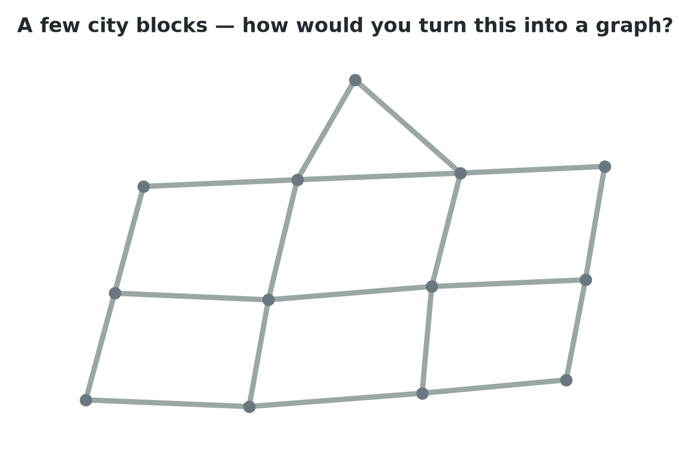

<!--
QUESTION-FIRST (review change 6 / Ben's split). Actually ask the room and WAIT —
don't reveal anything. The bare street patch is the prompt: how would YOU turn
this into nodes and edges? Almost everyone proposes intersections=nodes,
streets=edges — but don't say that here; let them say it. (The "most people say
intersections→nodes, streets→edges" prompt is a presenter cue, used to validate
whatever the room offers, NOT printed on the slide.) The NEXT slide reveals that
this instinct has a name. Do NOT show the primal labelling yet.
-->

---

# Most people say: the primal graph

The common instinct — and it's a good one:

- **intersections → nodes**
- **streets → edges**

That has a name: the **primal** graph. Geometry made into topology the obvious
way.

It is a **choice**, not the only one — as the next slide shows.

<!--
The reveal of the FIRST answer (review change 6 / Ben's split-(b)). Validate the
room's instinct, name it "primal" — intersections are nodes, street segments are
edges. Then immediately destabilise it: that was ONE modeling choice, not a law
of nature. This sets up "the other way: the dual graph" on the next slide and
the whole "no neutral graph" thesis of Beat 2. Same street-patch figure as the
question slide, now read as a primal graph (intersections = the dots, streets =
the links).
-->

---

# The other way: the dual graph

Flip it:

- **streets → nodes**
- **shared intersections → edges**

Now the graph is about **how the named-street system is wired**, not distances.

Streets are reconstructed across many segments via **Intersection Continuity
Negotiation** [(Porta et al., 2006, dual)](https://arxiv.org/abs/cond-mat/0512535).

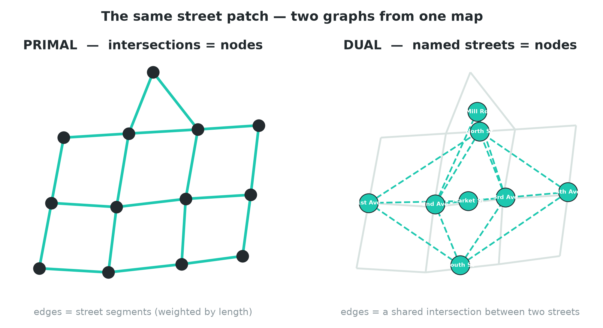

<!--
The reveal. The map-like figure shows the SAME street patch twice: primal
(intersections=nodes) and dual (named streets=nodes, linked where they cross).
Primal answers 'how far / how central geographically'; dual answers 'how is the
named-street system wired'. Stress: nothing changed about the city — only our
choice of what to call a node. That's the whole 'no neutral graph' thesis in
one figure. The demo builds BOTH and overlays their betweenness.
-->

---

# The teachable surprise

**Degree** = how many streets meet at a node. A **degree distribution** counts
how many nodes have each degree.

- **Primal:** degrees sit in a narrow range — most crossings are 3- or 4-way.
- **Dual, "scale-free-like":** a **few** streets (long through-streets) have
  **very high** degree; **most** have low — a heavy tail
  [(Porta et al., 2006, dual)](https://arxiv.org/abs/cond-mat/0512535).

> "Is this city scale-free?" has **no answer** until you fix the representation —
> the cleanest proof that **there is no neutral graph.**

<!--
Demystify the jargon (review change 9). "Scale-free" and "degree distribution"
are thrown around — gloss them in plain words. DEGREE of a node = how many edges
touch it = how many streets meet there. A DEGREE DISTRIBUTION is just a
histogram: for each possible degree, how many nodes have it. In the PRIMAL graph
of streets the distribution is narrow — almost every intersection is a 3-way or
4-way junction, so degrees cluster tightly around 3–4 (near-regular, planar). In
the DUAL graph (named streets as nodes), it's HEAVY-TAILED / "scale-free-like": a
handful of long arterial streets cross very many others, so they have huge degree,
while most short streets cross few — a long right tail instead of a tight cluster.
"Scale-free" loosely = no single typical degree; a few hubs dominate. Background
on scale-free / small-world: [(Newman, 2003)](https://arxiv.org/abs/cond-mat/0303516). This is the demo's headline
"wow" moment (the primal-vs-dual betweenness overlay). The point to drive: a
property you'd think is "about the city" turns out to be "about your graph
choice." Slightly unsettling — good; it motivates being explicit about every
modeling decision.
-->

---

# So which is best — primal or dual?

> Neither. The right model is the one that **matches the question** you're asking.

- A **distance / accessibility** question wants the **primal** (it knows lengths).
- A **named-street / system-structure** question wants the **dual** (it knows
  how streets connect as wholes).

Next slide: concrete examples of each.

<!--
Raise the 'which is best?' question explicitly (review change 8) and refuse the
premise — there's no universally-best model, only fit-to-question. This is the
CHOOSE skill in miniature, previewing Beat 5. Keep it short; the concrete
examples are the next slide. NOTE: we deliberately do NOT use turn-restriction
examples here — the demo's optional appendix owns those.
-->

---

# When primal is right vs. when dual is right

The figure says it: a **distance** question wants the **primal**; a
**named-street / system-structure** question wants the **dual**.

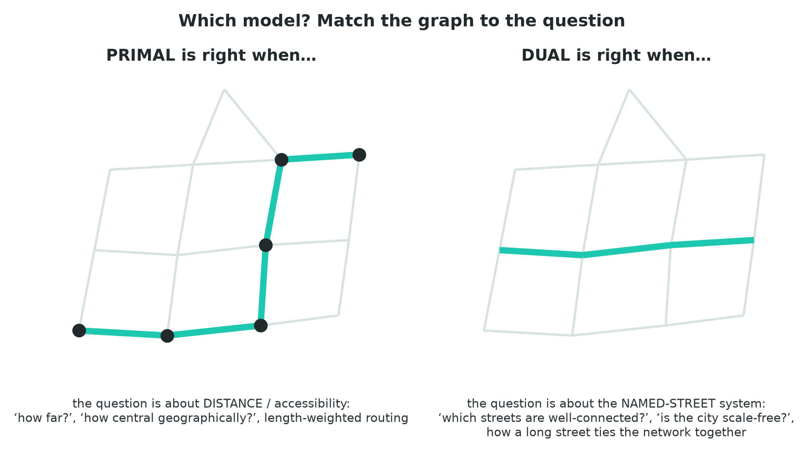

<!--
The figure ALREADY carries the primal/dual explanations panel-by-panel, so the
slide is just a one-line lead + the figure — the old redundant bullet list below
it was overflowing the 720px box and is removed (review change 10). Teach the
detail FROM THIS NOTE:

LEFT panel = PRIMAL's home turf. The primal graph (intersections = nodes, street
segments = edges, weighted by length) knows metric distance, so it answers "how
far is it?", "how central is this point geographically?", and powers
length-weighted routing and accessibility [(Porta et al., 2006)](https://arxiv.org/abs/physics/0506009). If the question
mentions distance, travel time, or "nearest", you want the primal.

RIGHT panel = DUAL's home turf. The dual graph (named streets = nodes, linked
where they cross) knows how the named-street SYSTEM is wired, so it answers
"which streets are well-connected AS WHOLE STREETS?", "is the city scale-free?",
and "how does one long arterial tie the whole network together?"
[(Porta et al., 2006, dual)](https://arxiv.org/abs/cond-mat/0512535). If the question is about streets-as-wholes, you want the
dual.

Tie back: this is the same CHOOSE muscle as picking a metric — now applied to
the GRAPH itself. No turn restrictions here (the demo's appendix owns those).
The very next slide drives home WHY the choice matters: a different graph tells
a literally different story.
-->

---

# A different graph tells a different story

The choice isn't cosmetic — it changes what a question even *means*:

- One long corridor is **one edge** in the primal…
- …but **one node** in the dual.

So *"which whole street is the best connected?"* is **natural in the dual**,
**awkward in the primal** (where that street is scattered across many edges).

<!--
This is the payoff of the primal/dual beat (review change 11). Make it concrete
with ONE corridor: take a single long named street. In the PRIMAL it's a chain
of many edges between many intersection-nodes — there's no single object that IS
"the street", so "how connected is this whole street?" has no clean home; you'd
have to aggregate over its segments. In the DUAL that entire corridor collapses
to ONE node, and its degree literally counts how many other streets it touches —
so "which whole street is best connected?" is a one-line query. Same city, same
reality, but the two graphs make DIFFERENT questions easy and different questions
hard. That's the whole "no neutral graph" thesis cashed out: you don't pick a
representation and then ask questions — your question should pick the
representation. Next slide: the choice also shapes how you TRAVERSE the graph.
-->

---

# It also shapes how you navigate the graph

The representation you choose changes **how graph traversal works**, too.

- Routing that counts **turns** is natural on the **dual** (a turn = moving from
  one street-node to the next).
- The same idea is clumsy on the primal, where a turn is hidden inside a node.

> **More on this in the demo** — we won't teach turn rules here.

<!--
Forward teaser, kept deliberately LIGHT (review change 11) — the demo's optional
appendix OWNS turn restrictions / fewest-turns routing, so do NOT actually teach
them here. The point to plant: the primal/dual choice doesn't just change which
METRICS are natural, it changes how NAVIGATION / graph traversal behaves. On the
dual, each node IS a street, so a step in the graph is "leave this street, enter
that one" = exactly one turn; counting turns (or forbidding illegal ones) is
then natural. On the primal a turn happens INSIDE an intersection node, so
turn-aware routing needs extra bookkeeping. Say just enough to intrigue, then
hand it to the demo: "you'll see fewest-turns routing on the dual in the demo's
appendix." This keeps the theory block on time and avoids stealing the demo's
reveal.
-->

---

# Storing geography: features vs. networks

Two ways GIS data is stored — and they answer different questions:

- **Feature model** — independent geometries (points / lines / polygons) with
  attributes. Great for "what is *here*?" (a parcel, a building, a road as a
  drawn line).
- **Network model** — explicit **nodes + edges + connectivity**. Needed for
  "how do I get from A to B?" — routing, centrality, flow.

A road drawn as a line **looks** like a network but isn't one until connectivity
is made explicit. Turning features into a routable graph is the work of Beat 2.

<!--
The 'feature vs network' framing (review change 5) explains WHY OSM data isn't
graph-shaped out of the box. Feature model = a bag of geometries (shapefile /
GeoJSON mindset): perfect for asking 'what's at this location'. Network model =
topology made explicit: required for routing/centrality. A line-string of a road
carries no notion that it CONNECTS to the cross street — connectivity is what we
must construct. This sets up both the OSM-model slide and the OSMnx-build slide.
-->

---

# The OSM data model: nodes, ways, relations

OpenStreetMap stores geography as **nodes**, **ways**, and **relations**, each
carrying **tags**.

- A street is a **`way`** — an ordered list of nodes.
- Tags: `highway`, `name`, `oneway`, `maxspeed`…

This is a **feature**-style store: a `way` is a drawn line, **not** a routable
edge yet.

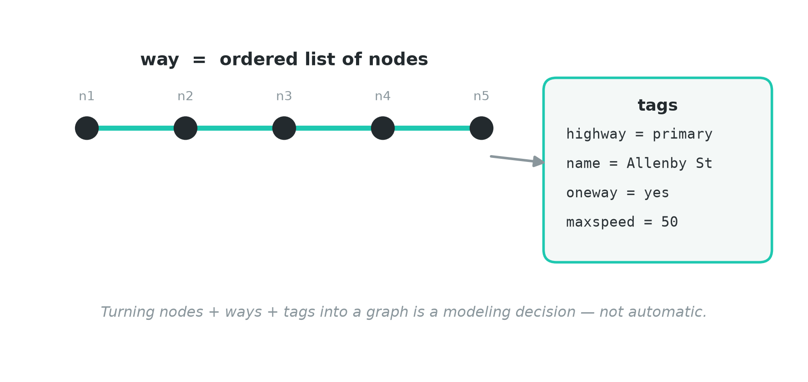

> **How you'd ask an AI:** *"Explain how OSM's node/way/relation + tag model maps
> onto graph nodes and edges — and where that mapping needs a judgment call."*

<!--
Vocabulary plant: node / way / relation / tag. Connect to the previous slide:
OSM is a feature store — a `way` is geometry + tags, not yet a graph edge.
The figure shows a 'way' as ordered nodes carrying tags. The punchline (next
slide) is that OSMnx must CONSTRUCT the connectivity. Ask the room: which OSM
nodes are real intersections, and which are just shape-points on a curve?
-->

---

# Aside · why OSM looks this way (not in the 45 min)

A little history earns the data model:

- OSM (2004) chose **nodes / ways / relations + free-form tags** to let *anyone*
  map *anything* — no fixed schema.
- Edits ship as **changesets**: every change is attributed, versioned, and
  reversible — a community audit trail.

So the data is **community-shaped**, not engineered for routing. That's *why* we
have to do construction work to get a graph.

> **How you'd ask an AI:** *"Give me the short history of OSM's tagging model and
> the changeset mechanism — why nodes/ways/relations + free tags?"*

<!--
OPTIONAL ASIDE — explicitly NOT counted in the 45-min budget; skip if short on
time. Depth lives here in the notes: OSM launched 2004 (Steve Coast), reacting
to closed/expensive national mapping data. The genius + the mess is the
free-form tag system: no rigid schema, so contributors can describe anything —
but tags are conventions, not guarantees (a street might lack a `name`, a
`maxspeed` might be missing). Changesets = the version-control layer: each edit
is a bundle, attributed to a user, timestamped, revertable; vandalism and errors
are auditable and fixable. The teaching point: the data is shaped by a community
process, which is exactly why it needs simplification/consolidation before it's
a clean routable graph. Backstory earns engagement (design note) — but keep the
SLIDE light; tell the story from the notes.
-->

---

# From OSM features to a graph: OSMnx

OSM data is **not graph-shaped**. OSMnx builds the graph:

- Keep **intersection** nodes (and dead-ends).
- **Drop interstitial shape-points** — an OSM `node` on a curve is geometry,
  **not** a graph node.
- Keep the curve's shape as an **edge attribute**.

So **OSM "node" ≠ graph node** [(Boeing, 2017)](https://arxiv.org/abs/1611.01890), [(Boeing, 2025a)](https://arxiv.org/abs/2505.00736).

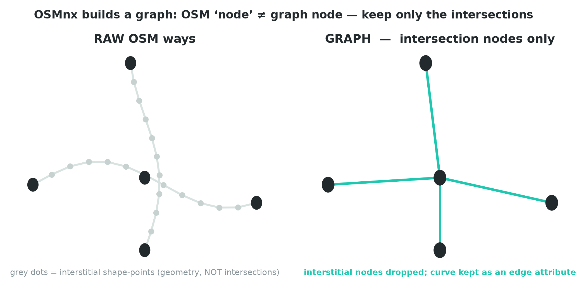

<!--
The intuition for how non-graph-shaped OSM becomes a graph (review change 9).
The figure: LEFT raw OSM ways = many grey interstitial shape-points along
curves; RIGHT the graph = only true intersection + endpoint nodes, edges
straightened, the curve preserved as an attribute. Hammer 'OSM node ≠ graph
node' — it's the most common confusion. This is also why raw OSM MISCOUNTS
intersections, which the next slide quantifies as a modeling choice.
-->

---

# OSMnx models it as a non-planar directed multigraph

OSMnx represents the network as a **non-planar directed multigraph**
[(Boeing, 2017)](https://arxiv.org/abs/1611.01890), [(Boeing, 2025a)](https://arxiv.org/abs/2505.00736):

- **multigraph** — two intersections can be joined by **more than one** street;
- **directed** — to encode **one-way** streets;
- **non-planar** — **bridges/tunnels** let edges cross without an intersection.

Each adjective is a **vocabulary term** *and* a **modeling commitment**.

> **How you'd ask an AI:** *"Load \<city\> with OSMnx (v2) as a non-planar
> directed multigraph and report its node/edge counts."*

<!--
Three adjectives = three modeling commitments (multigraph / directed /
non-planar). Code is pinned to OSMnx v2.x [(Boeing, 2025a)](https://arxiv.org/abs/2505.00736); cite boeing2017
for the idea, boeing2025 for today's API. The demo names all three on the live
object. Each adjective is also a piece of prompt vocabulary — students DIRECT
with these words.
-->

---

# Simplification is itself a modeling choice

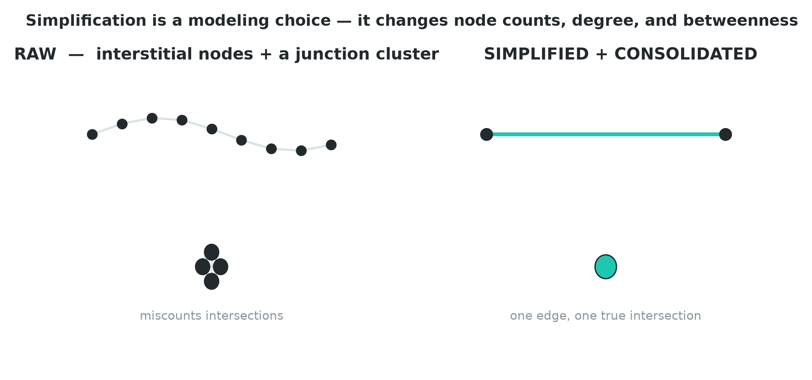

Raw OSM **miscounts intersections** [(Boeing, 2025b)](https://arxiv.org/abs/2407.00258): curved streets
become many short segments; one junction becomes a node **cluster**. **Edge
simplification** + **node consolidation** change node counts, degree, **and
betweenness** — downstream consequences.

<!--
Upgrades the operations sub-claim from hand-wave to citable craft. The
before/after figure: interstitial nodes + a roundabout cluster -> one edge, one
true intersection. Stress: skipping simplification silently inflates degree and
betweenness around roundabouts — a metric error that traces straight back to a
modeling choice you didn't realise you made.
-->

---

# Projection: metric centrality needs a metric CRS

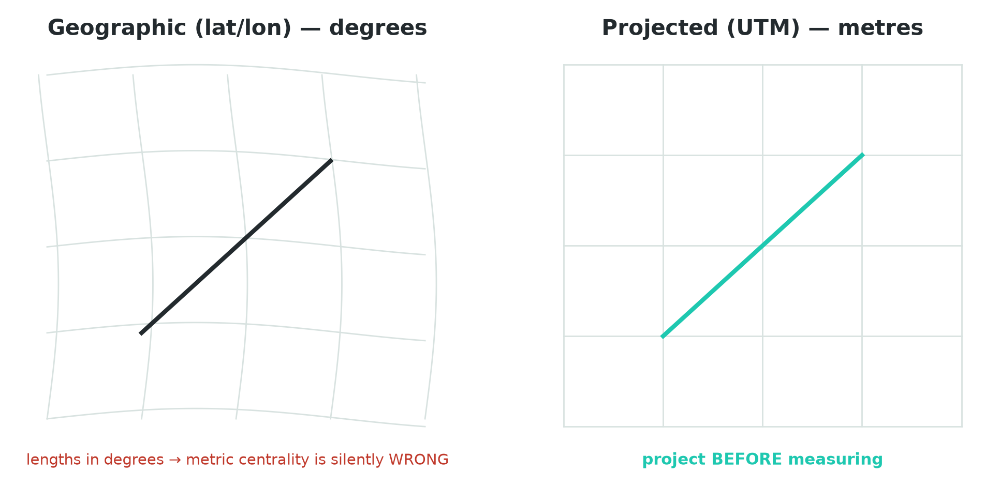

- A **CRS (Coordinate Reference System)** says what your coordinates mean.
- Geographic coords (**lat/lon**) are in **degrees** — not metres.
- **UTM** is a metric CRS (local zones measured in **metres**). Length-weighted
  centrality on an **unprojected** (degree) graph is **silently wrong**.
- Fix: **project to UTM** *before* measuring [(Boeing, 2017)](https://arxiv.org/abs/1611.01890).

> **How you'd ask an AI:** *"Project to the UTM CRS (a metric Coordinate
> Reference System, in metres) before any length-weighted centrality, and
> confirm the CRS is metric."*

<!--
Inoculates against the single most common tutorial bug. 'Projected vs geographic
CRS' is prompt-grade vocabulary. The figure contrasts the degree graticule vs a
metric grid. The demo confirms the UTM CRS out loud. 'Silently wrong' is the key
phrase — it runs, it returns numbers, the numbers are meaningless.
-->

---

# Connected components: compute on the LCC

- Real OSM pulls **fragment** into disconnected pieces.
- On a disconnected graph some node-pairs have **infinite distance** → closeness
  and betweenness are **ill-defined**.
- Extract the **largest connected component (LCC)**; report how many fragments
  dropped [(Boeing, 2017)](https://arxiv.org/abs/1611.01890).

> **How you'd ask an AI:** *"Reduce to the largest connected component and tell
> me how many nodes/edges that dropped."*

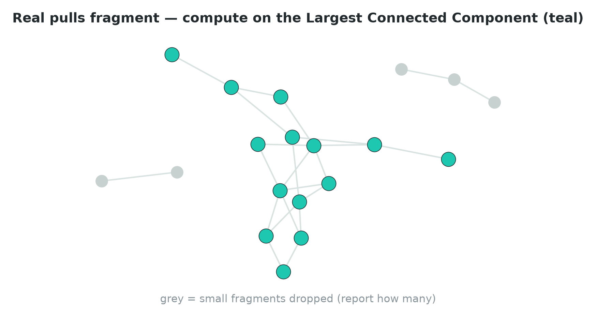

<!--
Make it concrete (review change 10): a clipped extract leaves a stray cul-de-sac
or a service road stub disconnected from the main grid. WHY we need the LCC:
shortest-path distance between two nodes in different components is infinite, so
closeness (1/sum of distances) and betweenness (fraction of shortest paths) have
no well-defined value — centrality is undefined on a disconnected graph. The
figure: LCC in teal, dropped fragments in grey. 'Largest connected component
(LCC)' is load-bearing for the practice task — removing a light-rail street can
disconnect a fringe, forcing an LCC recompute. Plant the term firmly.
-->

---

<!-- _class: section -->

# Beat 3 — Operationalizing "importance"
## *The centrality family — teach 5, compute 3* · ~12–15 min

---

# Centrality: making "important" computable

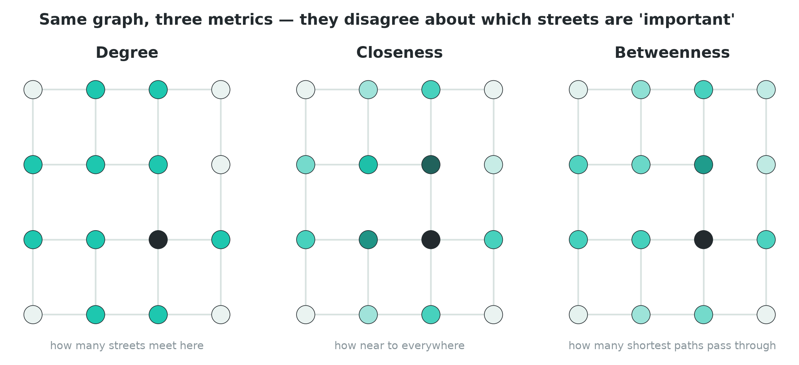

Back to the roadmap from Beat 1. The canonical treatment defines **five** measures
on metric-weighted **primal** graphs [(Crucitti et al., 2006)](https://arxiv.org/abs/physics/0504163), framed by
[(Porta et al., 2006)](https://arxiv.org/abs/physics/0506009) as everyday questions. We **teach five**; the demo **computes
three** (degree, closeness, betweenness).

<!--
Explicitly tie back to the 'measurements we'll build' roadmap (review change 11).
The figure is the unit's CHOOSE moment in one image: the SAME graph, three
metrics, three different 'important'. Teach-5-compute-3 keeps runtime + cognitive
load down; the next slide names all five, then we give the math.
(Change-11 ambiguity: I read 'reorder so the metric intro flows into the family'
as 'open the beat by referencing the Beat-1 roadmap' — done here. Flagged for
Ben to confirm.)
-->

---

# The five — plain-language questions

| Metric | Plain-language question | Captures |
|---|---|---|
| **Degree** | how many streets meet here? | local connectivity |
| **Closeness** | how near to everywhere? | "being near" |
| **Betweenness** | how many shortest paths pass through? | "being between" |
| **Straightness** | how direct are routes through here? | "being direct" |
| **Information** | how much does removing this hurt? | "being critical" |

<!--
Sources: degree/betweenness/information [(Crucitti et al., 2006)](https://arxiv.org/abs/physics/0504163); closeness/
straightness framing [(Porta et al., 2006)](https://arxiv.org/abs/physics/0506009). Straightness + information are named and
pointed to reading; the demo computes the first three. Next slide gives the math
for the three the demo actually computes.
-->

---

# The three we compute — defined

For a graph with $N$ nodes, node $v$:

$$ C_{deg}(v) = \frac{\deg(v)}{N-1} \qquad
   C_{clo}(v) = \frac{N-1}{\sum_{u\neq v} d(v,u)} $$

$$ C_{bet}(v) = \sum_{s\neq v\neq t} \frac{\sigma_{st}(v)}{\sigma_{st}} $$

where $d(v,u)$ is the (length-weighted) shortest-path distance, $\sigma_{st}$ the
number of shortest $s\!\to\!t$ paths, and $\sigma_{st}(v)$ those through $v$.

<!--
Give the math, not just prose (design note + review change 12). Degree
centrality = normalized degree. Closeness = inverse mean distance to everywhere
(needs the LCC — infinite distances break it — and a metric CRS — distances must
be metres). Betweenness = fraction of all shortest paths that route through v —
literally Freeman's 'being between'. Walk the betweenness sum slowly: for every
origin-destination pair, what share of their shortest paths pass through v.
Length-weighting is why projection matters. The demo computes exactly these
three (via igraph for speed — that's a demo concern, not a slide). The OTHER two
(straightness, information) get their own formula slide next, so all five are
defined — even though the demo computes only these three.
-->

---

# The other two — defined (taught, not computed)

For node $v$, with $d(v,u)$ the network distance and $d_{eucl}(v,u)$ the
straight-line distance:

$$ C_{str}(v) = \frac{1}{N-1}\sum_{u\neq v}\frac{d_{eucl}(v,u)}{d(v,u)}
   \qquad
   C_{inf}(v) = \frac{E - E_{(v)}}{E} $$

- **Straightness** — how close routes through $v$ are to "as the crow flies"
  ($\tfrac{d_{eucl}}{d}\!\to\!1$ means perfectly direct) [(Porta et al., 2006)](https://arxiv.org/abs/physics/0506009).
- **Information** — the **drop in network efficiency** $E$ when $v$ (and its
  edges) is removed, $E_{(v)}$ [(Crucitti et al., 2006)](https://arxiv.org/abs/physics/0504163).

<!--
Completes change 12: every one of the five now has a mathematical definition,
not just the three the demo computes. We TEACH these two but don't compute them
in the demo — name them as the conceptually-right tools and point to the reading.

STRAIGHTNESS centrality compares, for every other node u, the Euclidean
(crow-flies) distance to the actual network distance: the ratio is 1 when the
network route is perfectly straight and < 1 when it detours. Averaging over all
u gives v's straightness — "how direct are routes through here?" High where the
grid lets you go straight; low in a maze of bends and dead-ends. (Source: Porta
et al.'s primal-graph centrality framing.)

INFORMATION centrality scores an element by how much the whole network's
EFFICIENCY degrades when you delete it. Efficiency E is (roughly) the average of
1/distance over all node pairs — a global "how easily can everything reach
everything" number. Remove v and its edges, recompute efficiency E_(v); the
relative drop (E − E_(v))/E is v's information centrality. This is the "being
critical" metric — it maps directly onto the practice task's light-rail removal
(take a corridor out, ask what breaks). The formula here is the standard
efficiency-drop form; exact normalisations vary by source [(Crucitti et al., 2006)](https://arxiv.org/abs/physics/0504163).

Keep the slide to the two formulas + one line each; the depth is in this note.
-->

---

# Betweenness is the natural "artery" metric

Freeman's definition: centrality "in terms of the degree to which a point falls
on the **shortest path between others** and therefore has a potential for
**control of communication**" [(Freeman, 1977)](https://doi.org/10.2307/3033543).

→ The streets the **most shortest-paths route through** are the artery
candidates.

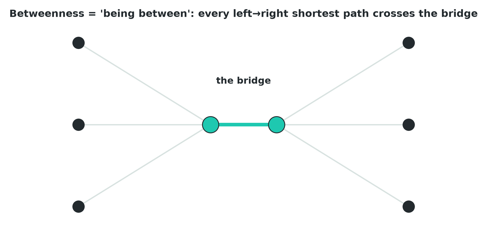

> **How you'd ask an AI:** *"Compute betweenness centrality, weighted by edge
> length, on the primal LCC, and highlight the top decile of streets."*

<!--
Betweenness = 'being between' = the artery hypothesis. The bridge figure makes
it visceral: every left->right shortest path crosses the bridge, so the bridge's
betweenness is maximal. The demo maps the top 10% under betweenness — that map
'looks like' arteries, which sets up the Beat-5 caveat. NetworkX/OSMnx implement
exactly Freeman's definition.
-->

---

# No single index is "the" importance

- Each metric answers a **different question** — a feature, not a flaw.
- "Information / being critical" is the most comprehensive, but the families
  "exhibit **highly diverse spatial flow patterns**" [(Porta et al., 2006)](https://arxiv.org/abs/physics/0506009), [(Crucitti et al., 2006)](https://arxiv.org/abs/physics/0504163).
- So a good analyst **CHOOSES** the metric to fit the question.

> This is the scholarly form of the North Star's **CHOOSE** skill — and why the
> demo maps three centralities side by side (they disagree).

<!--
Justifies the demo's side-by-side maps: degree/closeness/betweenness disagree
because they ask different questions. CHOOSE is the compounding skill of the
whole course — name it explicitly here. There is no 'the importance' number;
asking 'which centrality?' is asking 'which question am I really answering?'.
-->

---

<!-- _class: section -->

# Beat 4 — Structural metrics beyond centrality
## *One number for the whole fabric* · ~5–7 min

---

# Meshedness: how grid-like is this city?

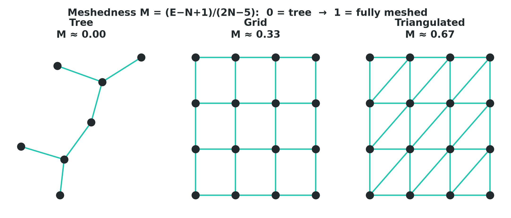

$$ M = \frac{E - N + 1}{2N - 5} \quad\in[0,1] $$

Defined by [(Buhl et al., 2004)](https://doi.org/10.1140/epjb/e2004-00364-9), applied to streets by [(Cardillo et al., 2006)](https://arxiv.org/abs/physics/0510162).
Cardillo's 20-city range: **0.014 (Irvine, tree-like) → 0.348 (New York)**. One
number, from adjacency alone.

<!--
TEACH-FROM-THESE-NOTES (review change 15 — Ben wants to be able to explain
meshedness cold).

WHAT IT MEASURES: meshedness asks "how many independent loops (redundant
routes) does this street fabric have, compared to the most it COULD have if it
were perfectly triangulated?" It's a single 0–1 score for the whole network.

THE NUMERATOR, E − N + 1: for a connected planar graph this is exactly the
number of INDEPENDENT CYCLES = the number of bounded faces = the number of
"city blocks" you could walk around. Intuition via Euler: a spanning TREE that
connects all N nodes uses exactly N−1 edges and has ZERO loops. Every edge you
add BEYOND those N−1 closes exactly one new independent loop. So E − (N−1) =
E − N + 1 counts the "extra" edges = the independent cycles = the faces. A tree
has E = N−1, so the numerator is 0 → M = 0 (no redundancy, only one route
between any two points).

THE DENOMINATOR, 2N − 5: this is the MAXIMUM number of independent cycles a
planar graph on N nodes can have. A maximal planar graph (a full triangulation)
has at most 3N − 6 edges, so its cycle count is (3N − 6) − N + 1 = 2N − 5.
Dividing by it normalises to [0, 1]: M = (actual independent cycles) / (planar
maximum). M = 1 would mean fully triangulated — every face a triangle.

READING THE THREE NUMBERS: M = 0 → a tree / dendritic layout (cul-de-sac
suburb, one way in and out, zero redundancy). M = 1 → fully triangulated (no
real city; the theoretical ceiling). M ≈ 0.33 (New York) → about a third of the
way to the planar maximum: a dense, redundant grid with many alternative
routes. Irvine at 0.014 is almost tree-like — sprawling loops-and-lollipops
suburbia. So meshedness answers "how grid-like / how redundant / how many
alternative routes" in ONE number, from adjacency alone — no lengths, no tags.

The figure's tree → grid → triangulated strip makes the [0,1] scale concrete.
Attribution: definition [(Buhl et al., 2004)](https://doi.org/10.1140/epjb/e2004-00364-9) (ant galleries, 2004), urban
application [(Cardillo et al., 2006)](https://arxiv.org/abs/physics/0510162); formula + range verified against the Cardillo
PDF.
-->

---

# Clustering coefficient: triangles vs. squares

**Clustering coefficient** — do a node's neighbors connect to each other
[(Newman, 2003)](https://arxiv.org/abs/cond-mat/0303516)?

**Low** in street networks: right-angle grids make **squares, not triangles**
[(Cardillo et al., 2006)](https://arxiv.org/abs/physics/0510162).

That low value is itself a domain insight — street networks are **not** social
networks.

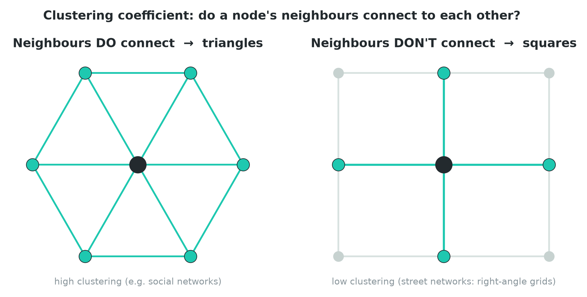

<!--
The clustering figure (review change 16): LEFT a social-style ego network where
neighbours connect to each other -> triangles -> high clustering; RIGHT a street
crossing where a node's neighbours are NOT directly connected (they meet only via
other intersections) -> squares -> clustering ~ 0. The teaching point: a metric's
VALUE is a finding. Low clustering tells you you're looking at a planar,
right-angle fabric, not a social graph — methods that assume triangle-rich
structure (some community-detection tricks) won't behave the same here.
-->

---

# More indices ≠ more insight

- **Connected components** — real pulls fragment; compute on the **LCC**
  [(Boeing, 2017)](https://arxiv.org/abs/1611.01890).
- The 2024 review shows **alpha / beta / gamma** indices are **redundant** —
  they mainly track average degree [(Barthelemy & Boeing, 2024)](https://arxiv.org/abs/2409.08016).

> Choosing *not* to compute a metric is itself a selection lesson — resist
> metric-collecting.

<!--
Split out from the old crammed clustering+components+curation slide to avoid
overflow. The curation point: the 2024 survey (the field's two leaders) shows
the classical alpha/beta/gamma transportation-geography indices are redundant
with average degree — so a good analyst DOESN'T compute them. Model good
judgment: more numbers is not more understanding. This is the same CHOOSE muscle
applied to 'which metrics are even worth computing'.
-->

---

<!-- _class: section -->

# Beat 5 — Matching metric to question
## *The skill that compounds* · ~6–8 min

---

# Through-traffic? — your call first

**Question:** which streets carry the most **through-traffic**?

Think before the reveal: of degree, closeness, betweenness, meshedness, the dual
— **which would you reach for, and why?**

<!--
QUESTION-FIRST metric->question, one per slide (review change 17). DON'T show the
answer yet — actually ask the room which measurement fits 'through-traffic', and
why. The figure (the bridge) is a hint, not the answer. Let 2–3 students commit
before you advance. The point of the question-first form: students rehearse
CHOOSE themselves instead of being told.
-->

---

# Through-traffic → betweenness (a hypothesis)

**Answer: betweenness on the primal.** The streets the most shortest-paths route
through are the through-traffic candidates.

**Caveat:** it is a **structural hypothesis**, not measured flow
[(Kazerani & Winter, 2009)](https://doi.org/10.13140/2.1.1739.0089), [(Gao et al., 2013)](https://doi.org/10.1068/b38141).

<!--
The reveal on the SAME figure. Betweenness 'being between' = the through-traffic
proxy; the bridge carries every left-right route. Re-flag the caveat (it's a
prediction, not a count) but lightly — the full reckoning is two slides on. The
practice baseline asks exactly this question about a light-rail removal.
-->

---

# Accessibility? — your call first

**Question:** which locations are the most **accessible** — nearest to
everywhere else?

Pick from degree, closeness, betweenness, meshedness, the dual — **which, and
why?**

<!--
QUESTION-FIRST (review change 13) — mirror the through-traffic pair. DON'T reveal
yet: ask the room which measurement fits 'most accessible / nearest to
everywhere'. The centrality_family figure is a hint (its middle panel is
closeness). The expected answer is closeness, because the question is literally
about average nearness — but let students commit before you advance. Contrast cue
to hold for the reveal: a NEAR street (high closeness) need not be a
through-route street (high betweenness).
-->

---

# Accessibility → closeness

**Answer: closeness.** High closeness = short **average distance to all other
nodes** — the "being near" metric [(Porta et al., 2006)](https://arxiv.org/abs/physics/0506009).

A street can be very **near** everything yet **not** lie on many through-routes —
closeness and betweenness answer different questions.

<!--
The reveal on the SAME figure. Closeness = inverse mean distance to everywhere,
so it directly answers 'nearest to everything'. Point at the centrality_family
middle panel. Drive the contrast: closeness ≠ betweenness — a node can be
central in the 'near' sense without being central in the 'between' sense. Needs
the LCC (infinite distances break the sum) and a metric CRS (distances in
metres). Different question, different metric — that's the CHOOSE muscle again.
-->

---

# Critical to remove? — your call first

**Question:** which streets are most **critical** — removing them hurts the
network most?

Of the family we've built, **which measurement would you reach for?**

<!--
QUESTION-FIRST (review change 13). Ask before revealing: 'most critical to
remove'. This is the closest theory question to the practice task (a light-rail
removal), so it's worth dwelling on. Students may reach for betweenness — a
reasonable guess — but the purpose-built answer is INFORMATION centrality, which
the next slide reveals. The LCC figure hints that removing an element can even
fragment the graph. Let 2–3 students commit.
-->

---

# Critical to remove → information

**Answer: information centrality** ("being critical") — how much network
**efficiency drops** when you delete the element [(Crucitti et al., 2006)](https://arxiv.org/abs/physics/0504163).

This is exactly the practice task's move: take a corridor out, ask **what
breaks**.

<!--
The reveal. Information centrality scores an element by the relative drop in
global efficiency when it's removed — the purpose-built 'critical to remove'
metric. It maps DIRECTLY onto the practice task's light-rail removal. The LCC
figure stands in for 'remove an element, the graph can even fragment'. (The demo
computes degree/closeness/betweenness, not information — name it as the
conceptually-right tool and point to the reading; students can approximate it by
an explicit before/after removal, which is exactly what the practice does.)
-->

---

# Grid-like? — your call first

**Question:** how **grid-like / redundant** is the whole fabric?

Careful — this one is about the **whole network**, not a single node. **Which
measurement fits?**

<!--
QUESTION-FIRST (review change 13), with a twist worth surfacing: unlike the
others, this question is about the ENTIRE fabric, not a per-node score — so the
centralities don't fit. Nudge students to notice that and reach for a
whole-network coefficient. The answer (next slide) is meshedness. The
tree→grid→triangulated strip is the hint.
-->

---

# Grid-like → meshedness

**Answer: meshedness** — one 0–1 number for the **entire network**: independent
loops vs. the planar maximum [(Cardillo et al., 2006)](https://arxiv.org/abs/physics/0510162).

High = many **redundant** routes (resilient grid); low = **tree-like**, fragile.

<!--
The reveal. This is the one whole-network (not per-node) question, so the answer
is a structural coefficient, not a centrality — meshedness M = (E−N+1)/(2N−5),
independent cycles over the planar maximum. High meshedness = many redundant
routes = resilient grid; low = tree-like, fragile (one way in, one way out).
Reuse the tree→grid→triangulated strip. Recall the full meshedness teaching note
from Beat 4 if students want the derivation.
-->

---

# Named-street / scale-free? — your call first

**Question:** is the city **scale-free**? how is the **named-street** system
wired?

This time the choice isn't a metric — it's **which graph**. **Which one?**

<!--
QUESTION-FIRST (review change 13), and the punchline of the whole beat: here the
right answer isn't a different METRIC, it's a different GRAPH. Ask the room — and
nudge them to recall Beat 2 — what would you reach for to ask 'is this city
scale-free / how is the named-street system wired?'. 'Scale-free?' is
unanswerable on the primal (near-regular degree, ~3–4 everywhere); the answer
(next slide) is the DUAL. Let them connect it back themselves.
-->

---

# Named-street / scale-free → the dual

**Answer: the dual graph.** Only the dual exposes the scale-free-like degree
distribution of **streets-as-wholes** [(Porta et al., 2006, dual)](https://arxiv.org/abs/cond-mat/0512535).

Sometimes the right move is to change your **representation**, not your metric.

<!--
The reveal, bringing the beat home to Beat 2. 'Scale-free?' has no answer on the
primal (degrees cluster at 3–4); the dual reveals a few very-high-degree streets
(long arterials crossing many others) and many low-degree ones — the heavy tail.
Reuse the map_primal_dual figure. Closing CHOOSE point of the whole beat:
matching question to representation is a superset of matching question to metric
— sometimes you change the graph, not the number.
-->

---

# The honest caveat, stated plainly

A high-betweenness map is a **prediction** from structure alone.

Observed flow depends on **origins, destinations, demand, and time of day** —
which topology **omits** [(Kazerani & Winter, 2009)](https://doi.org/10.13140/2.1.1739.0089), [(Gao et al., 2013)](https://doi.org/10.1068/b38141).

This is where **INTERPRET** lives, and where **Units 3 & 4** begin.

<!--
Second and final planting of the caveat (first was Beat 1). State it once,
clearly, and hand it forward. The figure reprises topology != flow. Practice
extension (c) is the student's chance to construct a case where a topology-only
answer misleads. INTERPRET is exactly noticing 'my central street is realistically
empty' — a surprise that's a lead, not a bug.
-->

---

# Rubric check — before you practice

In the supervised hour you run **direct → interpret → extend**:

- **DIRECT** — name the operation in unit vocab: *primal graph, simplification,
  projection / CRS, largest connected component, betweenness / closeness /
  degree, edge removal.* If your prompt reads the same for a non-geographer
  ("find the busy streets"), **tighten it**.
- **INTERPRET** — restate *which* streets changed, *by how much*, and whether it
  matches intuition. A surprise is a **lead**, not a bug.
- **EXTEND** — let your finding raise the next question.

> The single rubric you'll apply lives in `rubric.md`.

<!--
The mandated rubric-cite slide at the theory->practice hinge. The vocabulary list
is exactly what the practice task expects students to DIRECT with. Read the three
verbs against the upcoming light-rail task. Emphasise: vague prompts cost you
INTERPRET time untangling the agent's guess.
-->

---

# What the demo will show (handoff)

On **Jerusalem**, built **inline** from a Geofabrik extract via **pyrosm**:

1. **Operations** — simplify → project → consolidate → LCC.
2. **Three centralities** on the primal (degree, closeness, betweenness).
3. **Three top-decile maps** — same city, three different "important."
4. **The dual** + **primal-vs-dual betweenness overlay** — "no neutral graph."
5. **Which graph + metric = arteries?** — and the topology≠flow caveat.

*(Optional appendix: turn restrictions & fewest-turns routing on the dual.)*

<!--
No orphan slides, no orphan cells: this mirrors the demo's Sections 3-7 + the
OPTIONAL Section 8 appendix. Tell students the demo is the live enactment of the
five beats they just saw. The igraph/performance detail is deliberately a DEMO
concern, not a slide (we cut the 'betweenness is expensive' slide).
-->

---

# Then you practice: the light-rail stress test

> A new light-rail line will run down an existing surface street — those lanes
> leave the car network. **Which other streets suddenly carry the load — and are
> any of them streets to worry about?**

- Build the graph **before** and **after** (remove the route as car-routable).
- Choose and **justify** a centrality; compare before/after; **map and read it**.
- Pick an extension — including the **wrong-class** one (when does a
  topology-only answer mislead?).
- **Default city: Tel Aviv** (your own city encouraged). A **reference solution**
  ships from day 1 — it shows one path, not the answer.

<!--
Lands the theory on the exact task students attempt next. Demo = Jerusalem,
practice default = Tel Aviv. The wrong-class extension is where the Beat-1/Beat-5
caveat becomes the student's own argument. Edge removal is the one genuinely new
operation. This is the 'where to add transit' motivation from the very first
slide, now in the student's hands.
-->

---

# Forward connections

What you build in Unit 1 is the **substrate** for everything after:

- **U2** — trajectories live *on* this graph; map-matching needs its nodes/edges
  and projected CRS.
- **U3** — METR-LA sensors join to these nodes/edges.
- **U4** — shortest paths run here; topology fixed, **weights become time-varying**.
- **U5** — this adjacency **is** the GNN's input substrate.

> What compounds isn't graph-theory content — it's the **choice-making muscle**.

<!--
What you build in Unit 1 is the substrate for the whole course. Keep it brief —
the point is that the choice-making muscle compounds, not the graph-theory
content. The betweenness != flow gap is literally what U3 (real sensor flow) and
U4 (time-varying weights) close.
-->

---

# Further reading

- OSMnx: [(Boeing, 2017)](https://arxiv.org/abs/1611.01890), current API [(Boeing, 2025a)](https://arxiv.org/abs/2505.00736); simplification
  [(Boeing, 2025b)](https://arxiv.org/abs/2407.00258).
- Survey: [(Barthelemy & Boeing, 2024)](https://arxiv.org/abs/2409.08016); scale benchmark [(Boeing, 2020)](https://arxiv.org/abs/1705.02198).
- Centrality families: [(Porta et al., 2006)](https://arxiv.org/abs/physics/0506009), [(Crucitti et al., 2006)](https://arxiv.org/abs/physics/0504163); betweenness
  origin [(Freeman, 1977)](https://doi.org/10.2307/3033543).
- Primal vs. dual: [(Porta et al., 2006, dual)](https://arxiv.org/abs/cond-mat/0512535); network-science background
  [(Newman, 2003)](https://arxiv.org/abs/cond-mat/0303516).
- Structural metrics: [(Buhl et al., 2004)](https://doi.org/10.1140/epjb/e2004-00364-9), [(Cardillo et al., 2006)](https://arxiv.org/abs/physics/0510162).
- Topology ≠ flow: [(Kazerani & Winter, 2009)](https://doi.org/10.13140/2.1.1739.0089), [(Gao et al., 2013)](https://doi.org/10.1068/b38141).

Full annotated source list (AI-friendly summaries): [`further-reading.md`](./further-reading.md).

---

<!-- _class: lead -->

# Rights & disclaimer

**© 2026 Ben Galon. All rights reserved.** Part of the Geo-AI course (The
Arena). Provided to enrolled students for course use; not for redistribution.

**Built with AI assistance.** These slides were drafted with the help of AI and
**reviewed by a human instructor** — but they **may still contain mistakes**.
**Verify before you rely on anything here.**

> Treat every figure, formula, and claim as a starting point to check, not a
> final authority. The practice tasks are open-ended: a reference solution
> shows *a* strong path, not *the* answer.

<!--
Closing slide. Read the AI-assisted + human-reviewed + may-contain-mistakes
disclaimer aloud so the room knows to verify rather than trust. The rights line
matches NOTICE.md in the public repo.
-->
